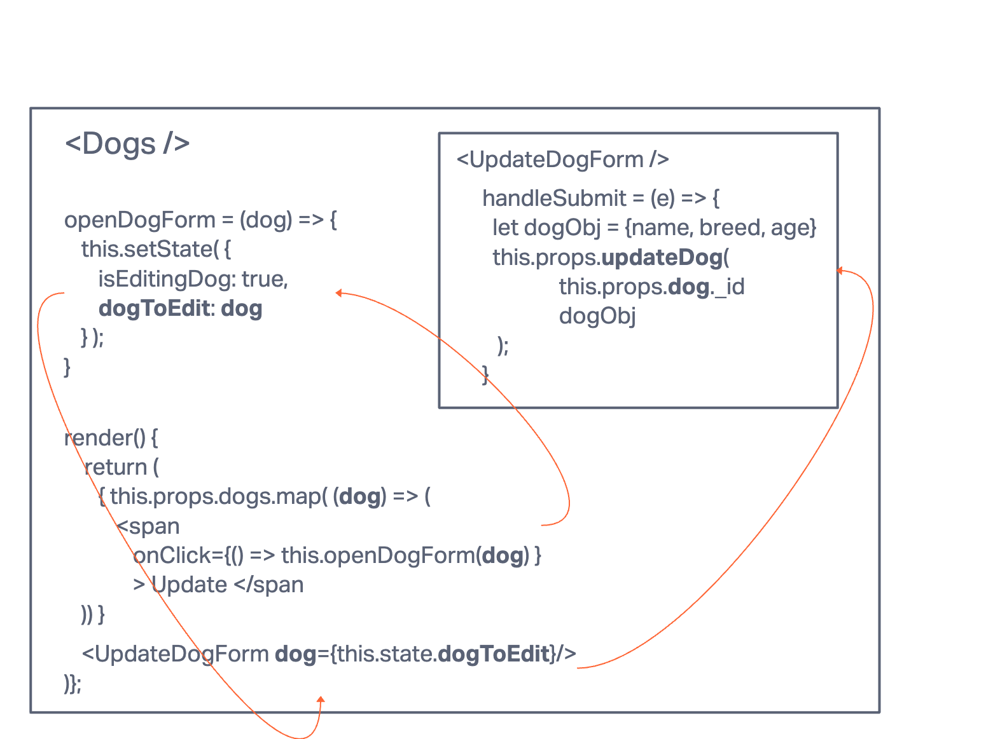

# Dogs!

This is a small CRUD app to keep track of all of the dogs in your life!

## Mockup

https://www.canva.com/design/DAFsPyyc7t0/O462AGtshVJ-HQvoZnieug/view?utm_content=DAFsPyyc7t0&utm_campaign=designshare&utm_medium=link&utm_source=publishsharelink

When you click new dog, the new dog form will appear.

When you click update dog, the update dog form will appear.

## Component Data Flow

### List all dogs

### Create new dog

### open form

### update a dog from our list
